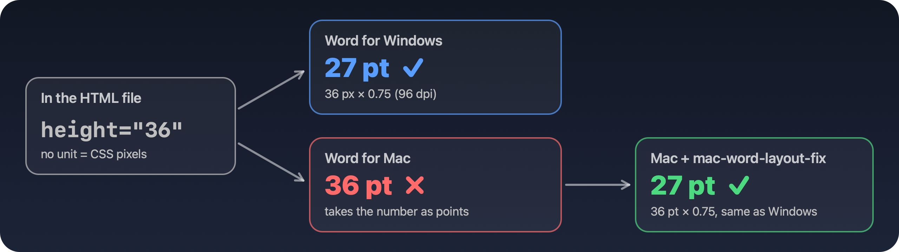

<p align="center">
  
</p>

<p align="center">
  
  
  
  
  
</p>

<p align="center">
  <b>English</b> · <a href="README.zh-TW.md">繁體中文</a>
</p>

---

Someone sends you a `.doc`. On Windows it fits on one page. On your Mac it spills onto a second page, and the fonts look wrong.

**The fonts aren't the only problem.** Many web systems (schools, HR portals, government sites) export "Word" files that are actually HTML pages with a `.doc` extension. **Word for Mac misreads their table row heights, so every row comes out 33% taller than on Windows.** No setting in Word changes that.

This repo fixes it.

<p align="center">
  
</p>

<p align="center"><sub>The same <a href="demo/coffee-guide.doc">demo file</a>. Left: a real export from Word for Windows. Middle and right: Word for Mac before and after the fix.</sub></p>

## ✨ Features

- 🎯 **Point-accurate.** Row heights match Word for Windows exactly (verified on both platforms).
- ⚡ **One command to install.** No dependencies, nothing to configure.
- 🤖 **Automatic.** A Word add-in fixes affected files the moment they open. A Scripts-menu item is there too.
- 🛡️ **Safe.** Only touches HTML-based documents, never saves your file, never modifies regular `.docx`.
- 🔤 **Font guide.** How to legally fill in missing Windows fonts such as 標楷體 and 新細明體.

## 🚀 Quick start

```bash
git clone https://github.com/Rui0828/mac-word-layout-fix.git
cd mac-word-layout-fix
./install.sh
```

Restart Word. That's it: HTML-based documents are fixed as they open. You can also run the fix by hand from **Scripts menu (📜) → Fix HTML Table Layout**.

Try it on [`demo/coffee-guide.doc`](demo/coffee-guide.doc): 2 pages → 1 page.

To remove it: `./uninstall.sh`

## 🔍 How it works

<p align="center">
  
</p>

HTML table heights are often written without a unit, meaning CSS pixels. Windows converts them at 96 dpi (× 0.75). Word for Mac uses the number as points, even though it converts font sizes in the same file correctly. The *Web Options → Pixels per inch* setting doesn't affect it.

Measured on the same file with Word 16.113 for Mac and Word 16.0 (build 20326) for Windows:

| HTML | Word for Windows | Word for Mac | Mac + fix |
|---|---|---|---|
| `height="36"` | 27 pt | 36 pt ❌ | 27 pt ✅ |
| `height="72"` | 54 pt | 72 pt ❌ | 54 pt ✅ |
| `height="114"` | 85.5 pt | 114 pt ❌ | 85.5 pt ✅ |
| font `15px` | 11.5 pt | 11.5 pt | 11.5 pt |

The fix detects documents that Word opened as HTML, walks every table (including nested ones), and scales row heights by 0.75. It only changes the document in memory.

## 🤖 Auto-fix add-in

`install.sh` also installs `dist/MacWordLayoutFix.dotm`, a Word add-in that fixes affected documents automatically as they open. You don't need to click anything. Regular `.docx` files are left alone (tested: a fixed file saved as `.docx` and reopened keeps its heights).

To check it's loaded: **Tools → Templates and Add-ins…** should list `MacWordLayoutFix.dotm`.

<details>
<summary>Rebuild the add-in from source</summary>

<br>

1. In Word, create a blank document and save it as **Word Macro-Enabled Template (.dotm)** named `MacWordLayoutFix.dotm`.
2. Open **Tools → Macro → Visual Basic Editor** and select that template's project.
3. **File → Import File…** and import `src/LayoutFix.bas` and `src/LayoutFixEvents.cls`. The `.cls` must appear under *Class Modules*; if it lands under *Modules*, the file lost its CRLF line endings.
4. Save, copy the file into `dist/`, and run `./install.sh`.

</details>

## 🔤 Missing fonts

<details>
<summary>Text wraps differently even though the font name looks right? Read this.</summary>

<br>

If a document uses fonts that only ship with Windows, Word for Mac silently substitutes them. The font box still shows the original name.

Fonts that ship with Windows are licensed for that Windows installation only. Microsoft's [font FAQ](https://learn.microsoft.com/en-us/typography/fonts/font-faq) says they may not be copied to other computers. The legal options are:

1. **Office cloud fonts.** Microsoft 365 for Mac bundles or downloads most Microsoft fonts on demand, including Calibri, Cambria, 微軟正黑體, 新細明體 and many decorative fonts. Accept Word's download prompt.
2. **A Mac font with the same design under a different name.** Map it in **Tools → Font Substitution…**.
3. **Buy a license** from the font's foundry.

| Windows font | What to do on Mac |
|---|---|
| 標楷體 (DFKai-SB) | macOS includes **標楷體-繁 (BiauKaiTC)**, the same DynaComware design. Substitute it. |
| 新細明體 / 細明體 (PMingLiU / MingLiU) | Office cloud font. |
| 微軟正黑體 (Microsoft JhengHei) | Office cloud font. |

To install fonts you are licensed to use:

```bash
./install.sh --fonts /path/to/licensed/fonts
```

</details>

## ❓ FAQ

<details>
<summary>Does it change my file?</summary>

<br>

No. It only changes the document open in Word. If you save an HTML-based document afterwards, the corrected heights are saved with it.
</details>

<details>
<summary>What about regular .docx files?</summary>

<br>

They aren't affected by this bug. `.docx` stores row heights in fixed units, so once the fonts match they lay out the same on both platforms.
</details>

<details>
<summary>How do I know if a file is HTML-based?</summary>

<br>

Open it in a text editor. If it starts with `<html`, it's HTML-based. The Scripts-menu fix also checks and tells you when no fix is needed.
</details>

<details>
<summary>Will it ever look 100% identical to Windows?</summary>

<br>

With matching fonts and this fix, page breaks match in our tests. Word can still reflow text very slightly between platforms ([Word MVP notes](https://wordmvp.com/Mac/Differences.html)), so for documents that must be pixel-perfect, export a PDF from Windows.
</details>

---

<p align="center">
  If this saved you from a 2-page form, consider giving it a ⭐<br>
  <sub>MIT License · Issues and PRs welcome</sub>
</p>
