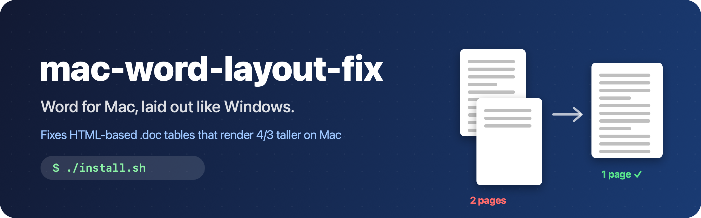
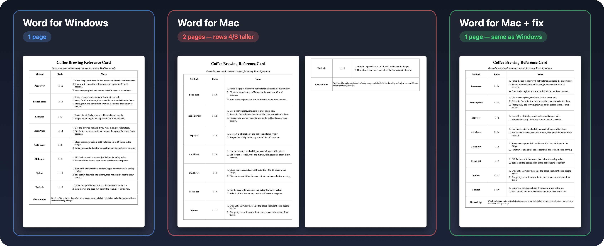
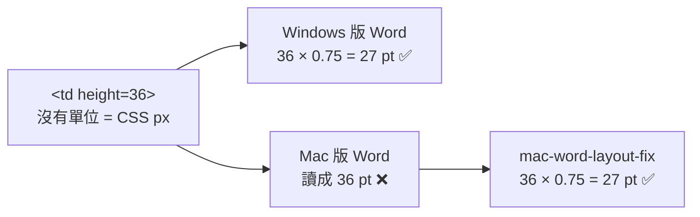

<p align="center">
  
</p>

<p align="center">
  
  
  
  
  
</p>

<p align="center">
  <a href="README.md">English</a> · <b>繁體中文</b>
</p>

---

別人傳來一份 `.doc`，在 Windows 上剛好一頁，用 Mac 打開卻多出第二頁，字型也不對。

**問題不只是字型。** 很多網站系統（學校、人事系統、政府網站）匯出的「Word 檔」，其實是副檔名取成 `.doc` 的網頁。**Mac 版 Word 會讀錯這種檔案的表格列高，每一列都比 Windows 高 33%。** Word 裡沒有任何設定能改。

這個專案就是修正它。

<p align="center">
  
</p>

<p align="center"><sub>同一份<a href="demo/coffee-guide.doc">示範檔案</a>。左：Windows 版 Word 實際匯出的結果。中、右：Mac 版 Word 修正前與修正後。</sub></p>

## ✨ 特色

- 🎯 **精準到點**：修正後的列高跟 Windows 版 Word 完全相同（兩邊都實測過）。
- ⚡ **一行指令安裝**：在 Word 的「指令碼」選單加入 *Fix HTML Table Layout*。
- 🤖 **可選的自動模式**：Word 增益集，有問題的檔案一打開就自動修正。
- 🛡️ **安全**：只處理網頁格式的文件，不會存檔，不會動到一般的 `.docx`。
- 🔤 **字型指南**：怎麼合法補齊標楷體、新細明體等 Windows 字型。

## 🚀 快速開始

```bash
git clone https://github.com/Rui0828/mac-word-layout-fix.git
cd mac-word-layout-fix
./install.sh
```

重新開啟 Word。打開版面跑掉的文件，點 **指令碼選單（📜）→ Fix HTML Table Layout**。

可以用 [`demo/coffee-guide.doc`](demo/coffee-guide.doc) 試試：2 頁 → 1 頁。

移除：`./uninstall.sh`

## 🔍 原理



網頁表格的高度常常沒寫單位，代表 CSS 像素。Windows 以 96 dpi 換算（× 0.75），Mac 版 Word 卻直接把數字當成 pt，但同一份檔案裡的字級它又換算正確。調整「網頁選項 → 每英吋像素」對這個問題沒有作用。

用同一份檔案，在 Mac 版 Word 16.113 和 Windows 版 Word 16.0（build 20326）實測：

| 網頁裡的設定 | Windows 版 Word | Mac 版 Word | Mac + 修正 |
|---|---|---|---|
| `height="36"` | 27 pt | 36 pt ❌ | 27 pt ✅ |
| `height="72"` | 54 pt | 72 pt ❌ | 54 pt ✅ |
| `height="114"` | 85.5 pt | 114 pt ❌ | 85.5 pt ✅ |
| 字級 `15px` | 11.5 pt | 11.5 pt | 11.5 pt |

修正工具會判斷文件是不是以網頁格式開啟，走過每一個表格（包含內層表格），把列高乘以 0.75。只改 Word 裡開著的內容。

## 🤖 自動修正增益集（選用）

增益集會在有問題的文件打開時自動修正。Word 只允許透過 VBA 編輯器加入程式碼，所以需要手動建立一次：

1. 在 Word 開一份空白文件，點「**工具 → 巨集 → Visual Basic 編輯器**」。
2. 選取這份文件的專案，點「**檔案 → 匯入檔案…**」，匯入 `src/LayoutFix.bas` 和 `src/LayoutFixEvents.cls`。
3. 關閉編輯器，點「**檔案 → 另存新檔…**」，格式選「**Word 啟用巨集的範本 (.dotm)**」，檔名取 `MacWordLayoutFix.dotm`。
4. 把檔案移到 `dist/`，再執行一次 `./install.sh`。

## 🔤 缺少字型

<details>
<summary>字型名稱看起來對，換行卻還是不一樣？看這裡。</summary>

<br>

文件用了只有 Windows 才有的字型時，Mac 版 Word 會自動替換，但字型欄還是顯示原本的名稱。

Windows 內附字型的授權只限那台 Windows 使用。微軟的[字型常見問題](https://learn.microsoft.com/en-us/typography/fonts/font-faq)寫明不得複製到其他電腦。合法的做法有：

1. **Office 雲端字型**：Mac 版 Microsoft 365 內建或會自動下載大部分微軟字型，包括 Calibri、Cambria、微軟正黑體、新細明體和許多裝飾字型。Word 詢問要不要下載時，按下載就好。
2. **用 Mac 上同款但名稱不同的字型替代**：在「**工具 → 字型替代…**」設定。
3. **購買授權**：向字型廠商購買。

| Windows 字型 | Mac 上的做法 |
|---|---|
| 標楷體 (DFKai-SB) | macOS 內建 **標楷體-繁 (BiauKaiTC)**，是華康同一款設計。用字型替代對應過去。 |
| 新細明體、細明體 (PMingLiU / MingLiU) | Office 雲端字型。 |
| 微軟正黑體 (Microsoft JhengHei) | Office 雲端字型。 |

安裝你有授權的字型：

```bash
./install.sh --fonts /有授權的/字型資料夾
```

</details>

## ❓ 常見問題

<details>
<summary>會改到我的檔案嗎？</summary>

<br>

不會，只改 Word 裡開著的內容。如果之後你自己儲存網頁格式的文件，修正後的列高會一起存進去。
</details>

<details>
<summary>一般的 .docx 呢？</summary>

<br>

不受這個問題影響。`.docx` 的列高用固定單位儲存，只要字型相同，兩邊的排版就一樣。
</details>

<details>
<summary>怎麼知道檔案是不是網頁格式？</summary>

<br>

用文字編輯器打開，開頭是 `<html` 就是網頁格式。指令碼選單的修正工具也會自動判斷，不需要修正時會告訴你。
</details>

<details>
<summary>能做到跟 Windows 百分之百一樣嗎？</summary>

<br>

字型相同再加上這個修正，我們測試的分頁位置都一致。不過 Word 在兩個平台之間仍可能有極小的排版差異（[Word MVP 的說明](https://wordmvp.com/Mac/Differences.html)），一定要完全一樣的文件，建議在 Windows 上轉成 PDF。
</details>

---

<p align="center">
  如果它幫你把兩頁的表單救回一頁，歡迎給個 ⭐<br>
  <sub>MIT 授權 · 歡迎提 Issue 和 PR</sub>
</p>
